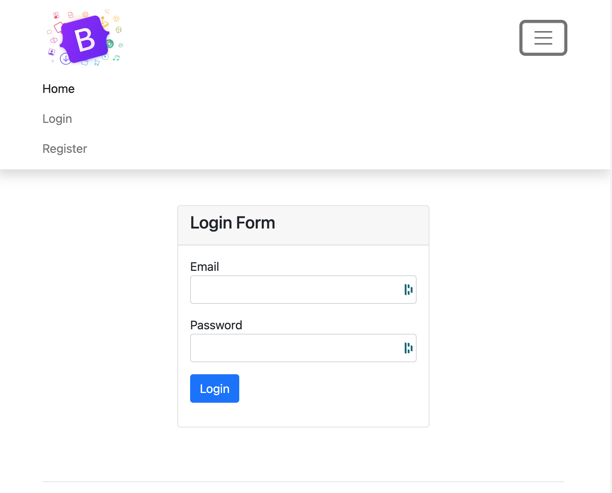

#  :rocket: Login and Authentication

## Demo project to work on login and auth functionalities in OOP PHP project

## Language/tools 🛠
- HTML5 / CSS3
- PHP7
- Bootstrap
  

## Goals 🏔
- Improve OOP concept
- Improve connection to db
- Improve login and auth function
- Work on input validation
  

## Setup 🛠

### Launch the development server with MAMP or WAMP

## Status 🎯
Project completed

## Context 🗓
Project developed as a junior web developer during my BTS SIO SLAM 
